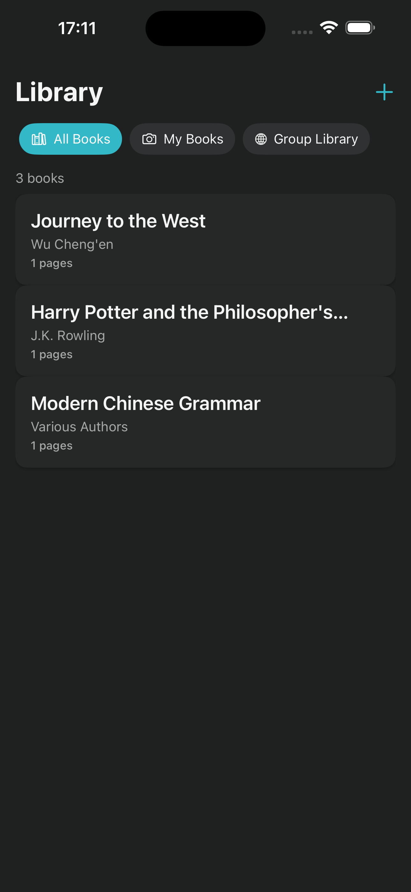
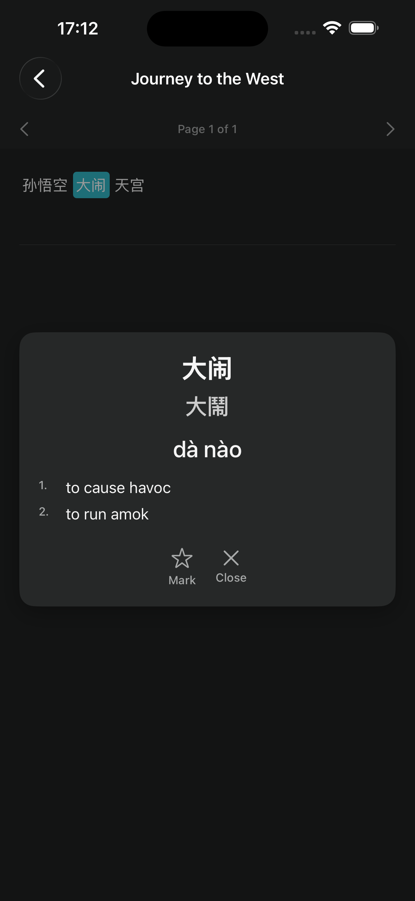
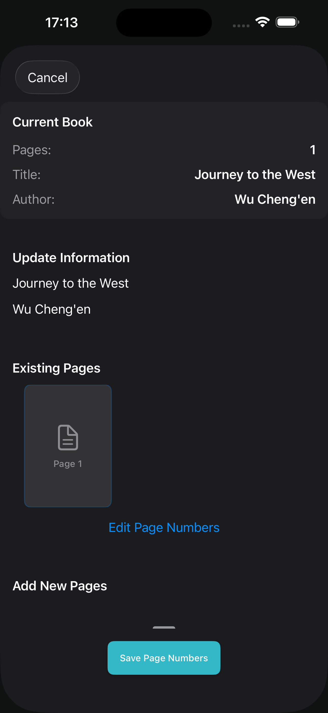
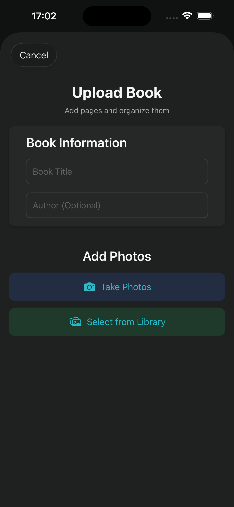
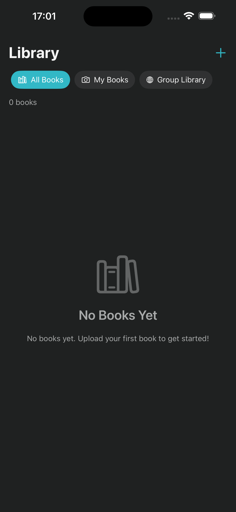

# Chinese Umbrella

A Chinese learning app built with SwiftUI that helps users learn Chinese characters through OCR and interactive reading.

## Screenshots

### Library View


*Browse your Chinese learning library with books organized by genre and reading progress.*

### Dictionary Lookup


*Instant dictionary lookup for Chinese characters with pinyin, definitions, and stroke order.*

### Book Editing


*Edit and manage your uploaded books with word segmentation and reading tools.*

### Upload Books


*Easily upload PDF books using OCR technology to extract Chinese text for learning.*

### Getting Started


*Start your Chinese learning journey by uploading your first book.*

## Setup

### Prerequisites

- Xcode 15.0+
- Ruby 3.1+ (for fastlane)
- iOS 17.0+ device/simulator

### Installation

1. Clone the repository:
   ```bash
   git clone https://github.com/dikology/chinese-umbrella.git
   cd chinese-umbrella
   ```

2. Install dependencies:
   ```bash
   bundle install
   ```

3. Open the project in Xcode:
   ```bash
   open umbrella/umbrella.xcodeproj
   ```

## Preview Mode for Screenshots

The app supports a preview mode that runs with mock data, perfect for taking App Store screenshots or testing the UI with realistic content.

### Enabling Preview Mode

**Xcode Scheme**
1. In Xcode, select the **umbrella** target.
2. Go to **Product > Scheme > Edit Scheme...**
3. Under the "Run" section, select the "Arguments" tab.
4. Add an entry to **Environment Variables**:
   - Name: `UMBRELLA_PREVIEW_MODE`
   - Value: `true`
   - Ensure the checkbox is selected.

This enables preview mode for all simulator and device runs using that scheme.

### What Preview Mode Includes

When enabled, the app will show:
- **Journey to the West** (Chinese literature book with sample pages and word segments)
- **Harry Potter and the Philosopher's Stone** (English fiction book)
- **Modern Chinese Grammar** (Chinese education book with segmented text)

All books include:
- Realistic page content with Chinese characters
- Word segmentation data
- Proper metadata (authors, genres, page counts)

### Running in Simulator

1. Enable preview mode using one of the methods above
2. Open the project in Xcode
3. Select an iOS Simulator (iPhone 15 recommended)
4. Press `Cmd+R` to run
5. The app will launch with mock data instead of requiring real books

## Fastlane Setup

This project uses fastlane for automated testing and deployment to TestFlight.

### Local Development

1. Install Ruby dependencies:
   ```bash
   bundle install
   ```

2. Run tests:
   ```bash
   bundle exec fastlane test
   ```

3. Build locally (development export):
   ```bash
   bundle exec fastlane build_local
   ```

### Code Signing Setup

This project uses [match](https://docs.fastlane.tools/actions/match/) for code signing. To set up code signing:

1. Create a private certificates repository (or use existing one)
2. Set up the following environment variables:
   - `MATCH_GIT_URL`: URL to your certificates repository
   - `MATCH_PASSWORD`: Password for encrypted certificates
   - `MATCH_GIT_BRANCH`: Branch in certificates repo (default: main)

3. For local development, you can also set:
   - `EXPORT_METHOD`: Set to "development" for dev builds

### TestFlight Deployment

#### Manual Deployment

1. Ensure you have the required environment variables set
2. Run the beta lane:
   ```bash
   bundle exec fastlane beta
   ```

#### CI/CD Deployment

The project includes a GitHub Actions workflow that automatically deploys to TestFlight when:

- A commit message contains `[deploy]` and is pushed to main branch, OR
- The workflow is manually triggered

### Required Secrets for CI/CD

Add these secrets to your GitHub repository:

#### App Store Connect API Key (Recommended)
- `APP_STORE_CONNECT_API_KEY_ID`: Your API key ID
- `APP_STORE_CONNECT_ISSUER_ID`: Your issuer ID
- `APP_STORE_CONNECT_API_KEY_CONTENT`: The full content of your .p8 file

#### Match (Code Signing)
- `MATCH_GIT_TOKEN`: GitHub personal access token for certificates repo
- `MATCH_PASSWORD`: Password for encrypted certificates
- `MATCH_GIT_BRANCH`: Branch in certificates repo (optional, defaults to master)

#### Keychain (for CI)
- `MATCH_KEYCHAIN_PASSWORD`: Password for temporary CI keychain

### Available Fastlane Lanes

- `test`: Run the test suite
- `build`: Build and archive for TestFlight (app-store export)
- `build_local`: Build and archive for development (development export)
- `beta`: Build and upload to TestFlight
- `screenshots`: Capture App Store screenshots
- `upload_screenshots`: Upload screenshots to App Store Connect
- `ci`: Run tests and deploy to TestFlight if conditions met

### Troubleshooting

#### Common Issues

1. **Certificate not found**: Ensure your certificates repository is set up correctly and `MATCH_GIT_URL` points to it.

2. **API Key issues**: Verify that your App Store Connect API key has the correct permissions and the content is properly formatted.

3. **Provisioning profile issues**: Make sure the bundle identifier `com.dikology.umbrella` is registered in your Apple Developer account.

4. **Keychain issues in CI**: The CI workflow creates a temporary keychain for code signing.

#### Getting Help

- Check fastlane output for detailed error messages
- Use `FASTLANE_VERBOSE=true` for more detailed logging
- Ensure Xcode Command Line Tools are installed: `xcode-select --install`

## Project Structure

- `umbrella/`: Main iOS application
  - `umbrella/`: Source code
    - `Data/`: Data layer (Core Data models, repositories)
    - `Domain/`: Business logic (entities, use cases)
    - `Infrastructure/`: External services and utilities
    - `Presentation/`: SwiftUI views and view models
    - `Resources/`: Static assets and data files
  - `umbrellaTests/`: Unit tests
  - `umbrellaUITests/`: UI tests
- `fastlane/`: Fastlane configuration
- `.github/workflows/`: GitHub Actions CI/CD

## Contributing

1. Fork the repository
2. Create a feature branch
3. Make your changes
4. Run tests: `bundle exec fastlane test`
5. Submit a pull request

## Privacy Policy

This app collects minimal data and processes all information locally on your device. See [PRIVACY_POLICY.md](PRIVACY_POLICY.md) for detailed information about data collection and privacy practices.

## Distribution

### TestFlight External Testing

This app is available for external testing via TestFlight. External testers can access the app through TestFlight without requiring developer account access.

#### For Testers
1. Receive an invitation email from the developer
2. Click the invitation link to open TestFlight
3. Install the Chinese Umbrella app
4. The app will be available on your home screen for 90 days

#### Requirements
- iOS 17.0 or later
- iPhone or iPad with camera access
- At least 100MB free storage space

### App Store Submission

When submitting to the App Store, ensure you have:
- Privacy Policy URL in App Store Connect
- Appropriate age rating (4+ recommended for educational apps)
- App Store screenshots
- App description and keywords

## Support

For questions about the app or testing:
- Create an issue in this repository
- Contact the developer through GitHub

## License

See LICENSE file for details.